# Nabd Clinic Booking System

A modern, full-stack clinic management system built with Spring Boot and vanilla JavaScript. This project provides a complete solution for managing doctors, patients, and appointments with a beautiful Arabic-first UI and robust database consistency.


---

## Overview

**Nabd (نبض)** means "Pulse" in Arabic. This clinic booking system is designed to provide a seamless experience for patients to book appointments with specialized doctors. The system features a modern Arabic RTL interface, robust backend APIs, and complete relational database integrity with SQL Server.

The project demonstrates a complete booking flow with:
- Patient registration and duplicate prevention
- Doctor selection by specialty
- Appointment scheduling with time slots
- Automatic relationship table population
- Full data consistency across all tables

---

## Features

- **Patient Management** - Register patients with Egyptian phone validation and duplicate prevention via email
- **Doctor Management** - View doctors by specialty with consultation fees
- **Appointment Booking** - Interactive booking with date/time selection and availability display
- **Relationship Consistency** - Automatic population of `patient_doctors` and `appointment_doctors` junction tables
- **Arabic UI** - Native RTL support with beautiful Arabic typography (Tajawal, Amiri fonts)
- **Responsive Design** - Works seamlessly on desktop, tablet, and mobile devices
- **REST API** - Clean RESTful endpoints for all CRUD operations
- **Transaction Safety** - Atomic operations with proper rollback on failure

---

## Tech Stack

### Backend
| Technology | Purpose |
|------------|---------|
| Java 17+ | Core language |
| Spring Boot 3.5 | Application framework |
| Spring Data JPA | Data persistence |
| MS SQL Server | Database |
| Maven | Build tool |

### Frontend
| Technology | Purpose |
|------------|---------|
| HTML5 | Structure |
| CSS3 | Styling with CSS Variables |
| JavaScript ES6+ | Logic and interactivity |
| Font Awesome | Icons |
| Google Fonts | Arabic typography |

---

## Project Structure

```
clinic_ssys/
├── frontend/
│   ├── images/              # Doctor photos and logo
│   ├── index.html           # Landing page
│   ├── booking.html         # Appointment booking form
│   ├── appointments.html    # View/manage appointments
│   ├── main.js              # UI logic and animations
│   ├── data.js              # API service layer
│   └── style.css            # Complete styling
├── backend/
│   ├── src/main/java/hana/com/clinic_system/
│   │   ├── controllers/     # REST API endpoints
│   │   ├── entities/        # JPA entity classes
│   │   ├── repositories/    # Data access layer
│   │   ├── exception/       # Global exception handling
│   │   └── config/          # CORS and encoding config
│   └── pom.xml
├── database/
│   └── clinic_system.sql    # Complete schema and seed data
├── screenshots/             # UI and validation screenshots
├── Meet_Our_Team.png
└── README.md
```

---

## Screenshots

### Home Page & UI

| Loading Screen | Home Page |
|:--------------:|:---------:|
| 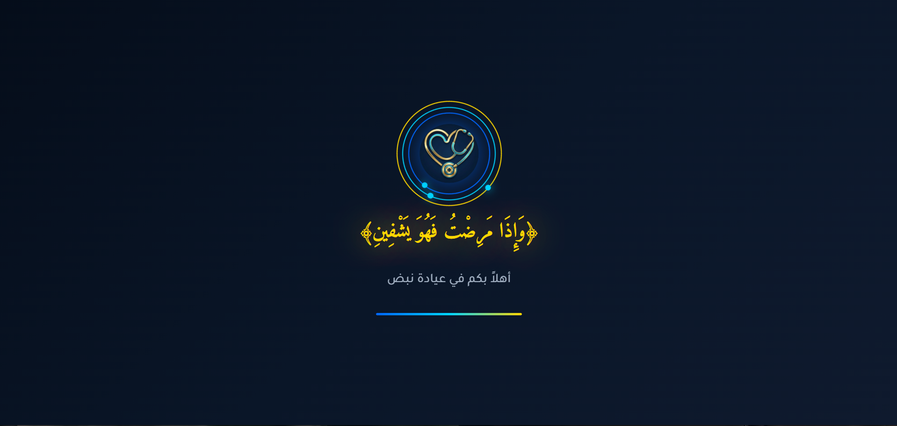 | 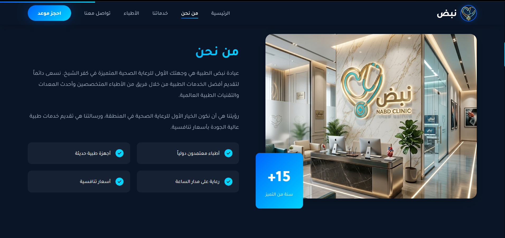 |

| Services Section | Why Choose Us |
|:----------------:|:-------------:|
| 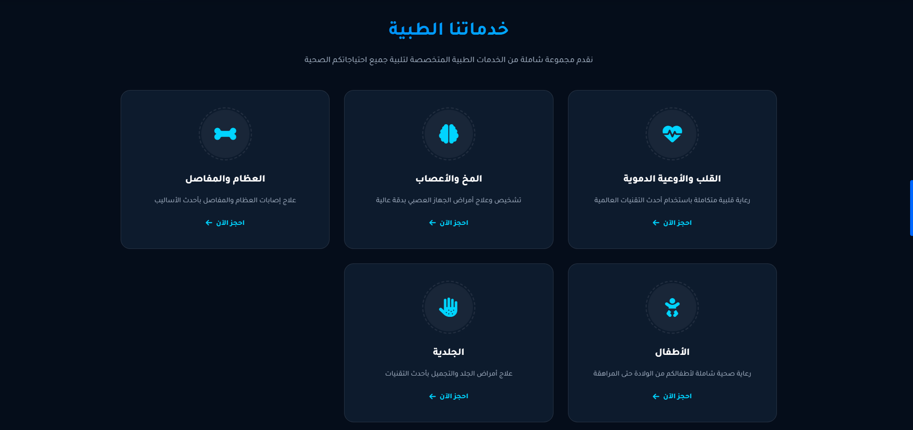 | 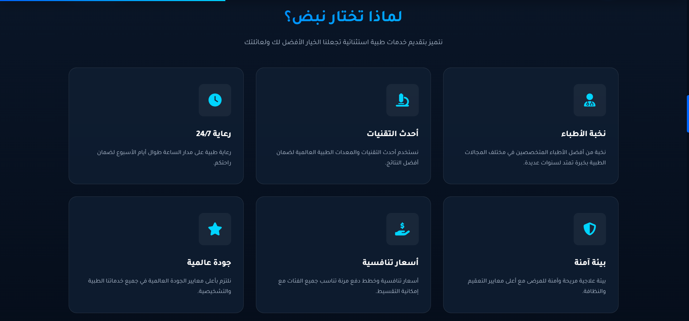 |

| Doctors Section (Top) | Doctors Section (Bottom) |
|:---------------------:|:------------------------:|
| 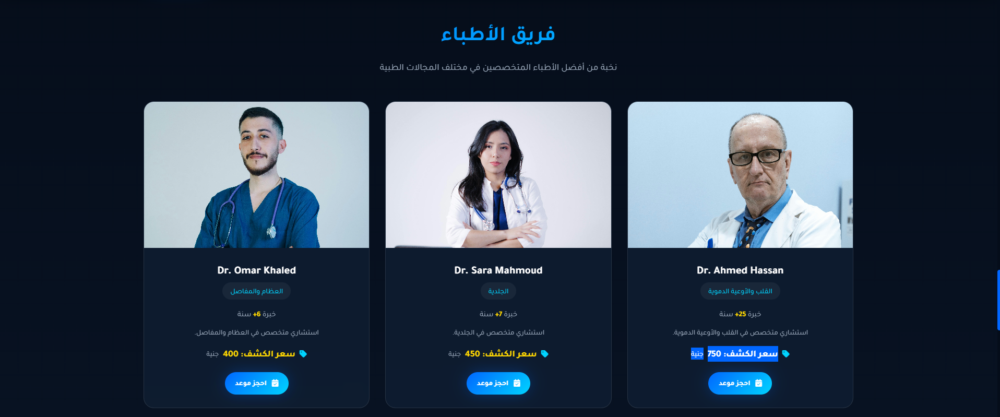 |  |

| Contact Section |
|:---------------:|
| 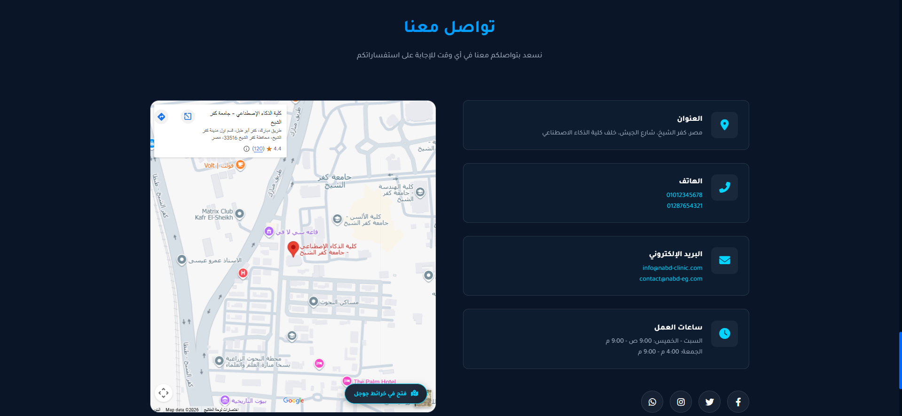 |

### Booking & Appointments

| Booking Page | My Appointments |
|:------------:|:---------------:|
| 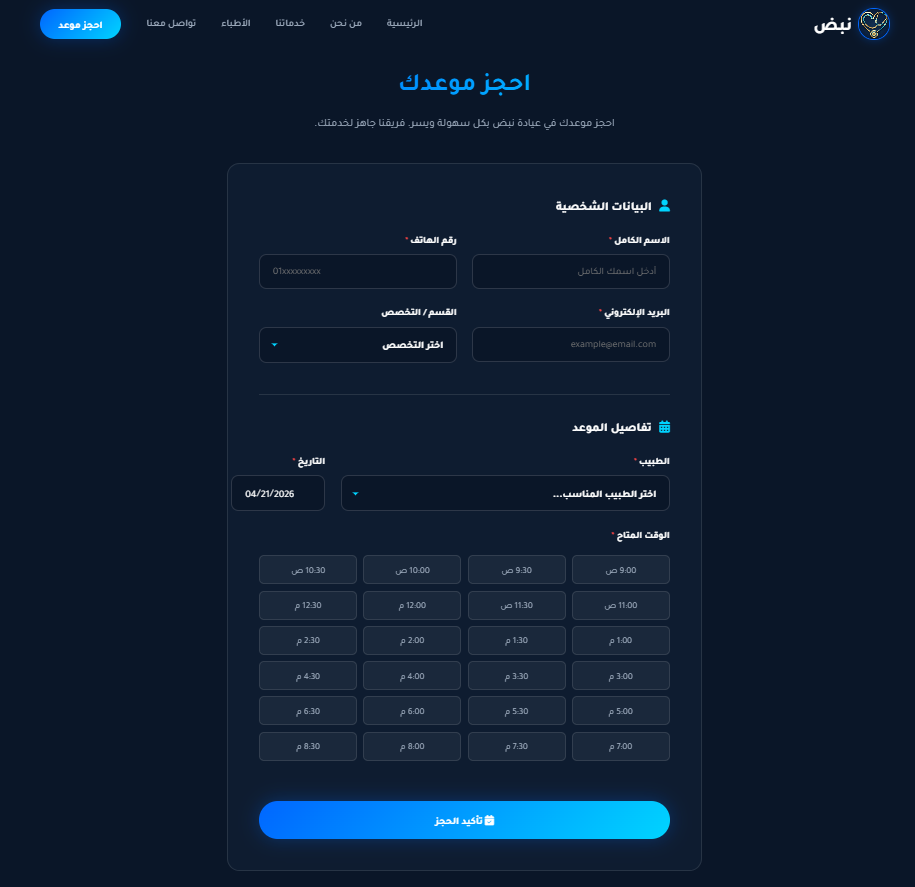 | 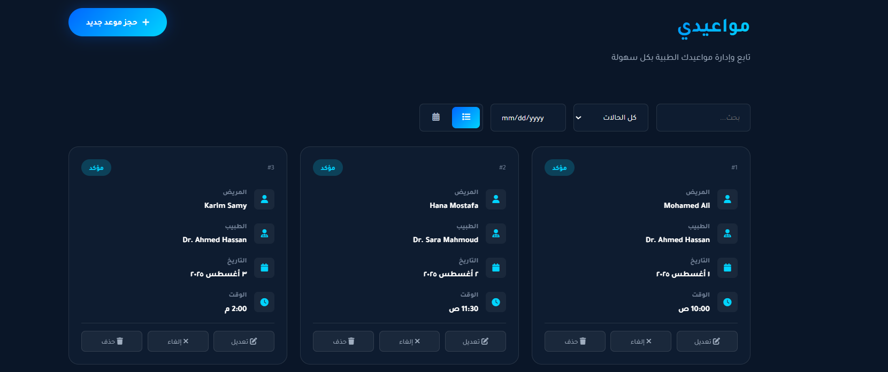 |

| My Appointments (List View) |
|:---------------------------:|
| 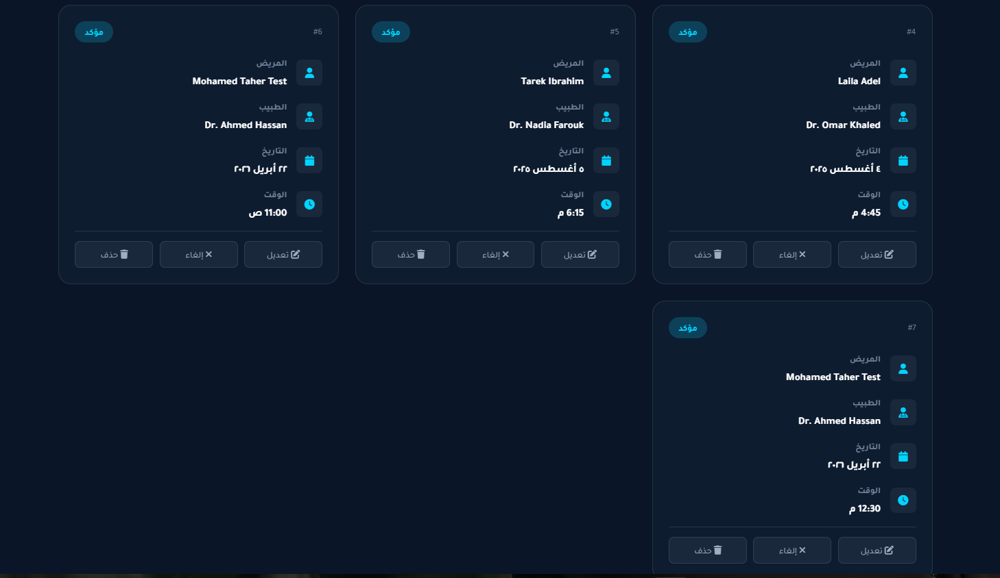 |

---

## Database Validation

The following screenshots demonstrate successful data insertion across all database tables after booking operations:

### Patients Table
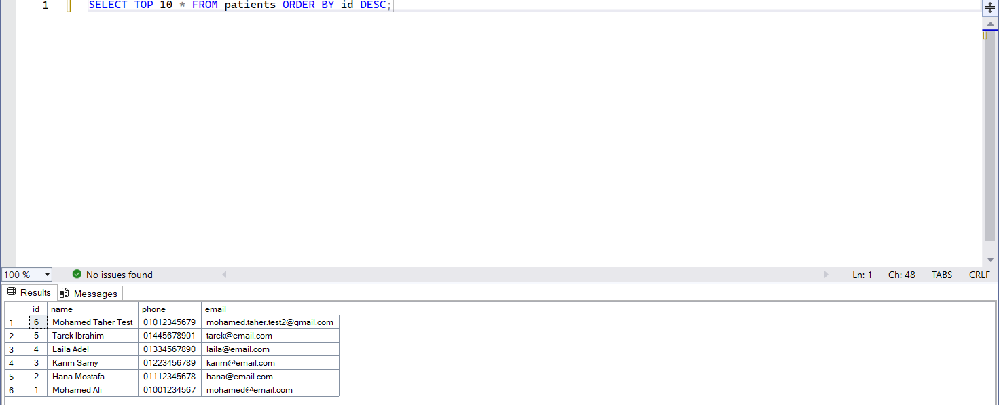

### Appointments Table
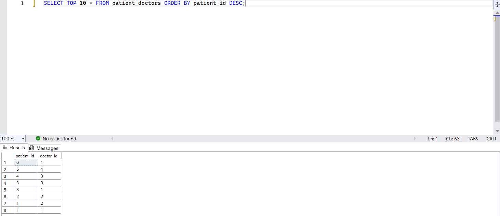

### Patient-Doctors Junction Table
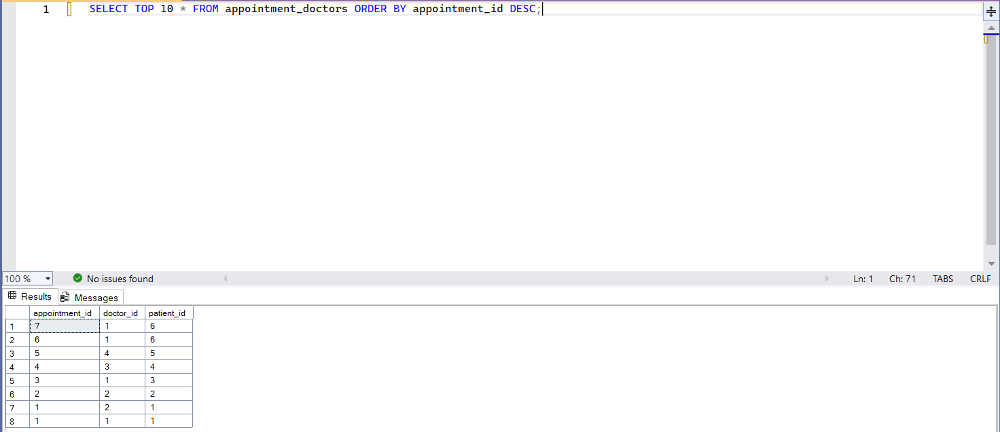

### Appointment-Doctors Junction Table
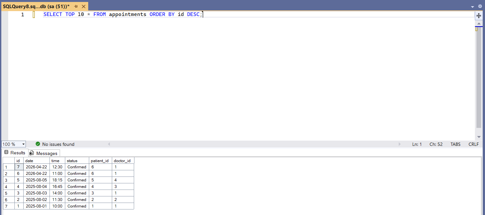

---

## Booking Flow Validation

The system has been thoroughly tested for both new and existing patient scenarios:

### Scenario 1: New Patient Booking

When a new patient books an appointment:

1. **Patient Creation** - New patient record inserted into `patients` table
2. **Appointment Creation** - New appointment record inserted into `appointments` table
3. **Patient-Doctor Relation** - New relation inserted into `patient_doctors` junction table
4. **Appointment-Doctor Relation** - New relation inserted into `appointment_doctors` junction table

```
┌─────────────┐    ┌──────────────┐    ┌─────────────────┐    ┌────────────────────┐
│  patients   │───>│ appointments │───>│ patient_doctors │    │appointment_doctors │
│  (INSERT)   │    │   (INSERT)   │    │    (INSERT)     │    │     (INSERT)       │
└─────────────┘    └──────────────┘    └─────────────────┘    └────────────────────┘
```

### Scenario 2: Existing Patient Booking

When an existing patient books another appointment:

1. **Patient Lookup** - Patient found by email (404 avoided)
2. **Patient Reuse** - Existing patient record used, no duplicate created
3. **Appointment Creation** - New appointment record inserted
4. **Relation Check** - `patient_doctors` checked; no duplicate if relation exists
5. **New Appointment Relation** - New `appointment_doctors` record created

```
┌─────────────┐    ┌──────────────┐    ┌─────────────────┐    ┌────────────────────┐
│  patients   │───>│ appointments │    │ patient_doctors │───>│appointment_doctors │
│  (REUSE)    │    │   (INSERT)   │    │  (SKIP/INSERT)  │    │     (INSERT)       │
└─────────────┘    └──────────────┘    └─────────────────┘    └────────────────────┘
```

### Database Tables Schema

```sql
-- Core Tables
doctors (id, name, specialization)
patients (id, name, phone, email)
appointments (id, date, time, status, patient_id, doctor_id)

-- Junction Tables (Many-to-Many)
patient_doctors (patient_id, doctor_id)
appointment_doctors (appointment_id, doctor_id, patient_id)
```

---

## How to Run

### Prerequisites

- Java 17 or higher
- MS SQL Server (Express edition works)
- Maven (included via wrapper)

### Step 1: Clone the Repository

```bash
git clone https://github.com/MohamedxTaher/clinic.git
cd clinic
```

### Step 2: Set Up the Database

Open SQL Server Management Studio and execute:

```sql
-- Run the contents of database/clinic_system.sql
-- This creates the clinic_db database and all tables
```

### Step 3: Configure Database Connection

Edit `backend/src/main/resources/application.properties`:

```properties
spring.datasource.url=jdbc:sqlserver://localhost\SQLEXPRESS;databaseName=clinic_db;encrypt=false;trustServerCertificate=true
spring.datasource.username=your_username
spring.datasource.password=your_password
```

### Step 4: Run the Backend

```bash
cd backend
./mvnw spring-boot:run
```

Or on Windows:
```bash
cd backend
.\mvnw.cmd spring-boot:run
```

### Step 5: Access the Application

- **Frontend:** Open `frontend/index.html` in your browser
- **Backend API:** `http://localhost:8080/api`

---

## API Endpoints

### Doctors
| Method | Endpoint | Description |
|--------|----------|-------------|
| GET | `/api/doctors` | Get all doctors |
| GET | `/api/doctors/{id}` | Get doctor by ID |
| DELETE | `/api/doctors/{id}` | Delete doctor |

### Patients
| Method | Endpoint | Description |
|--------|----------|-------------|
| GET | `/api/patients` | Get all patients |
| GET | `/api/patients/{id}` | Get patient by ID |
| GET | `/api/patients/email/{email}` | Get patient by email |
| POST | `/api/patients` | Create new patient |
| PUT | `/api/patients/{id}` | Update patient |
| DELETE | `/api/patients/{id}` | Delete patient |

### Appointments
| Method | Endpoint | Description |
|--------|----------|-------------|
| GET | `/api/appointments` | Get all appointments |
| GET | `/api/appointments/{id}` | Get appointment by ID |
| POST | `/api/appointments` | Create new appointment |
| PUT | `/api/appointments/{id}` | Update appointment |
| DELETE | `/api/appointments/{id}` | Delete appointment |

### Patient-Doctors Relations
| Method | Endpoint | Description |
|--------|----------|-------------|
| GET | `/api/patient-doctors/patient/{id}` | Get doctors for patient |
| GET | `/api/patient-doctors/doctor/{id}` | Get patients for doctor |
| POST | `/api/patient-doctors` | Create relation |
| DELETE | `/api/patient-doctors/patient/{pId}/doctor/{dId}` | Delete relation |

### Appointment-Doctors Relations
| Method | Endpoint | Description |
|--------|----------|-------------|
| GET | `/api/appointment-doctors/appointment/{id}` | Get doctors for appointment |
| GET | `/api/appointment-doctors/doctor/{id}` | Get appointments for doctor |
| POST | `/api/appointment-doctors` | Create relation |
| DELETE | `/api/appointment-doctors/appointment/{aId}/doctor/{dId}` | Delete relation |

---

## Configuration

### Database Configuration

```properties
# Connection
spring.datasource.url=jdbc:sqlserver://localhost\SQLEXPRESS;databaseName=clinic_db
spring.datasource.username=sa
spring.datasource.password=your_password

# JPA/Hibernate
spring.jpa.hibernate.ddl-auto=validate
spring.jpa.show-sql=false
```

### CORS Configuration

CORS is configured in `CorsConfig.java` to allow requests from:
- `http://localhost:5500`
- `http://127.0.0.1:5500`

---

## Team Members

|The Team Behind This Project |
|:---------------------------:|
|  |

| Name |
|------|
| **Mohamed Taher Elrefaey** |
| **Kareem Mohamed Zaki** |
| **Ganna Amr Emad** |
| **Maryam Mohamed Darwish** |
| **Haneen Mahmoud Abdelfatah** |
| **Hana Hamdy Mohamed** |

---

## License

This project is licensed under the MIT License - see the [LICENSE](LICENSE) file for details.


---

**Nabd Clinic** - نبض الحياة بين يديك
